# Predicting Titanic Survival
Sean Angiolillo  
3 January 2017  


## Introduction

The goal of this data analysis is to predict survival on the Titanic based on a dataset provided by Kaggle. Rather than goals like interpretability or scalability, I'll focus only on prediction accuracy as the metric of interest. I'll first explore the dataset, perform cleaning as necessary, feature engineer any possibly useful predictors, perform variable selection, and then explore different models using a few common ML algorithms.

My local CV score for my best model is 0.83944, but my public leaderboard score is only 0.78468, which suggests to me there is some problem with my model. As this is my first kernel, I'd be very grateful for suggestions. 


```r
# load required libraries
library(caret)
library(randomForest)
library(plyr)
library(dplyr)
library(ggplot2)
library(mice)
library(gridExtra)
library(stringr)
```

After loading the necessary libraries, we can load in the datasets downloaded directly from [Kaggle](https://www.kaggle.com/c/titanic/data).


```r
# load data
training <- read.table("train.csv", sep = ",", header = TRUE,
                       na.strings = c("", "NA"))
testing <- read.table("test.csv", sep = ",", header = TRUE,
                         na.strings = c("", "NA"))
```

First, let's look at the structure of the variables in the dataset.


```r
# examine structure of dataset
str(training)
```

```
## 'data.frame':	891 obs. of  12 variables:
##  $ PassengerId: int  1 2 3 4 5 6 7 8 9 10 ...
##  $ Survived   : int  0 1 1 1 0 0 0 0 1 1 ...
##  $ Pclass     : int  3 1 3 1 3 3 1 3 3 2 ...
##  $ Name       : Factor w/ 891 levels "Abbing, Mr. Anthony",..: 109 191 358 277 16 559 520 629 417 581 ...
##  $ Sex        : Factor w/ 2 levels "female","male": 2 1 1 1 2 2 2 2 1 1 ...
##  $ Age        : num  22 38 26 35 35 NA 54 2 27 14 ...
##  $ SibSp      : int  1 1 0 1 0 0 0 3 0 1 ...
##  $ Parch      : int  0 0 0 0 0 0 0 1 2 0 ...
##  $ Ticket     : Factor w/ 681 levels "110152","110413",..: 524 597 670 50 473 276 86 396 345 133 ...
##  $ Fare       : num  7.25 71.28 7.92 53.1 8.05 ...
##  $ Cabin      : Factor w/ 147 levels "A10","A14","A16",..: NA 82 NA 56 NA NA 130 NA NA NA ...
##  $ Embarked   : Factor w/ 3 levels "C","Q","S": 3 1 3 3 3 2 3 3 3 1 ...
```

Let's make `Survived` and `Pclass` factor variables to begin.


```r
# convert factor variables in training set
training$Survived <- factor(training$Survived)
training$Pclass <- factor(training$Pclass)
```

## Explore the Dataset

I'll go through each variable in the training set and try to feature engineer any new variables that might be useful.

### Sex

A mosaic plot is a useful tool to start visualizing the data given that we can proportion area into certain categories and observe the discrepancy in size between survivors and victims. The mosaic plot comparing survival by `Sex` shows females are much more likely to survive than males. 


```r
# plot survival by sex
mosaicplot(table(training$Survived, training$Sex))
```

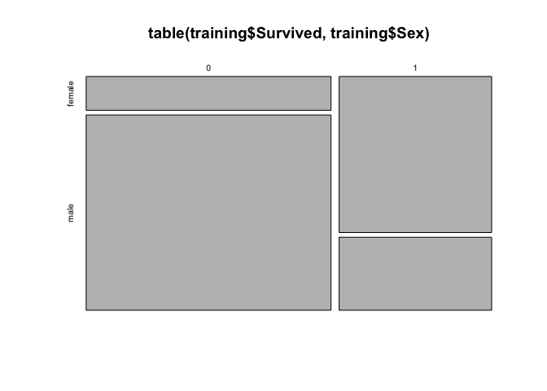<!-- -->

More directly we can see the discrepancy in survival rates in the table below.


```r
# prop table of survival by sex
round(prop.table(table(training[,c("Survived", "Sex")])),2)
```

```
##         Sex
## Survived female male
##        0   0.09 0.53
##        1   0.26 0.12
```

`Sex` is clearly a variable we need to include in the model.

### Pclass

In addition to gender, socioeconomics, as evidenced by `Pclass`, clearly played a role as those in first class were more likely to surive than third class passengers. We can see this in a mosaic plot.


```r
# plot survival by Pclass
mosaicplot(table(training$Survived, training$Pclass))
```

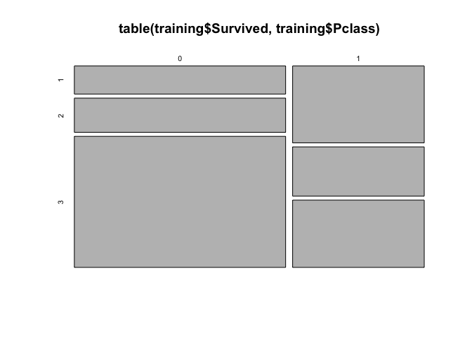<!-- -->

The table shows the exact proportions.


```r
# prop table of survival by Pclass
round(prop.table(table(training[,c("Survived", "Pclass")])),2)
```

```
##         Pclass
## Survived    1    2    3
##        0 0.09 0.11 0.42
##        1 0.15 0.10 0.13
```

### Embarked

The distribution of surival rates across points of embarkation (`Embarked`) is also not uniform.


```r
# plot survival by embarked
mosaicplot(table(training$Survived, training$Embarked))
```

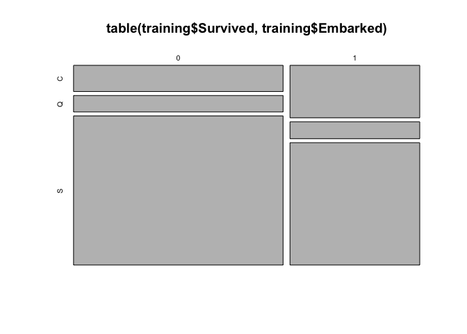<!-- -->

If we compare embarkation point with `Pclass` we see that `Q` boarded almost exclusively 3rd class passengers. `C` boarded more first than third. It's possible this variable may be useful, but most of its information seems likely to already be included in `Pclass`.


```r
# prop table of survival by embarked
round(table(training[,c("Pclass", "Embarked")]),2)
```

```
##       Embarked
## Pclass   C   Q   S
##      1  85   2 127
##      2  17   3 164
##      3  66  72 353
```

We do have just 2 missing values for `Embarked`. If we choose to include `Embarked` in our final model, we'll have to decide whether to exclude these passengers or impute a value, such as "C" since it has the most first class passengers.

Rather than exclude these passengers over a missing variable we may not end up using, I'm going to impute values to them. Although `SibSp` and `Parch` suggest they were traveling alone, given that they paid the same `Fare` and were assigned the same `Cabin`, I want to impute the same value for `Embarked`. "C" is the most common value for first class passengers, and so I'll assign them "C".


```r
# impute C to missing embarked values
training$Embarked[is.na(training$Embarked)] <- "C"
```

### Name

`Name` could be useful in that we can extract titles from it. Most of its information will already be contained in `Sex`, however a few titles may communicate additional information about a passenger's status such as "Dr" or "Master", which may or may not be already accounted for by `Pclass`. All 6 Reverends, for instance, were victims-- more than we might expect for second class male passengers. 


```r
# extract titles and compare survival status
training$Title <- factor(str_extract(training$Name, "\\w+(?=\\.)"))
cbind(table(training$Title, training$Survived))
```

```
##            0   1
## Capt       1   0
## Col        1   1
## Countess   0   1
## Don        1   0
## Dr         4   3
## Jonkheer   1   0
## Lady       0   1
## Major      1   1
## Master    17  23
## Miss      55 127
## Mlle       0   2
## Mme        0   1
## Mr       436  81
## Mrs       26  99
## Ms         0   1
## Rev        6   0
## Sir        0   1
```

This list could use some cleaning. `Mlle` for Mademoiselle, `Lady` and `Ms` can be recoded as `Miss`. `Mme` for Madame, `Countess` and `Dona` (found in validation set!) can be recoded as `Mrs`. We can create a honorific male category for `Sir`, `Major`, `Col`, `Jonkheer`, `Capt`, `Don`, and `Col`.


```r
# first create the new level
levels(training$Title) <- c(levels(training$Title), "HonM")

# define reassignments
single_ladies <- c("Mlle","Lady","Ms")
hon_male <- c("Sir","Major","Col","Jonkheer","Capt","Don","Col")
mrs <- c("Mme", "Countess", "Dona")

# relabel factors
training$Title[training$Title %in% single_ladies] <- "Miss"
training$Title[training$Title %in% mrs] <- "Mrs"
training$Title[training$Title %in% hon_male] <- "HonM"

# drop unused levels
training$Title <- droplevels(training$Title)

# confirm results
cbind(table(training$Title, training$Survived))
```

```
##          0   1
## Dr       4   3
## Master  17  23
## Miss    55 131
## Mr     436  81
## Mrs     26 101
## Rev      6   0
## HonM     5   3
```

This leaves us with categories that communicate not only gender, but in some cases status, or even special professions like `Rev` or `Doc`.

One drawback we might find with this variable is that when we break up our data into a training and testing set, certain categories may only be present in one but not the other. So the rare cases might be a problem for some algorithms. It's also colinear with other variables (`Sex` and `Age`).

### Cabin

`Cabin` is missing for the majority of passengers. Where it is present, it is overwhelmingly present for first class passengers. And so in a sense most of the information from `Cabin` appears to already be present in `Pclass`. 


```r
# Pclass distribution where Cabin is not missing
training %>%
    filter(Cabin != "") %>%
    group_by(Pclass) %>%
    dplyr::summarize(n = n())
```

```
## # A tibble: 3 x 2
##   Pclass     n
##   <fctr> <int>
## 1      1   176
## 2      2    16
## 3      3    12
```

Nevertheless, we can create a variable for passengers who have been assigned a berth, `BerthAssgn` and later determine if it is influential. Comparing survival rates by this new variable does seem to help differentiate the data, but it is largely colinear with `Pclass`. 


```r
# create a variable based on if passenger assigned a cabin
training$BerthAssgn <- factor(ifelse(is.na(training$Cabin), 0, 1))
prop.table(table(training$BerthAssgn, training$Survived))
```

```
##    
##              0          1
##   0 0.53984287 0.23120090
##   1 0.07631874 0.15263749
```

Alternatively, we could create a `Deck` variable by extracting the first letter of the `Cabin`. Based on the iceberg collision, it's possible the location of a passenger's cabin would have played an important role. But from the table below, it's not clear this `Deck` variable captures that information. 


```r
# create Deck variable
training$Deck <- substr(training$Cabin, 1,1)
training$Deck[is.na(training$Deck)] <- "Missing"
training$Deck <- factor(training$Deck)
table(training$Deck, training$Survived)
```

```
##          
##             0   1
##   A         8   7
##   B        12  35
##   C        24  35
##   D         8  25
##   E         8  24
##   F         5   8
##   G         2   2
##   Missing 481 206
##   T         1   0
```

### SibSp and Parch

Family relations are encoded in the variables `SibSp` and `Parch`. `SipSp` counts the number of siblings and/or spouse traveling with the passenger. `Parch` counts the number of parents or children traveling with the passenger. 

Family size does appear to have an impact. According to the mosaic plots below, solo travellers are less likely to survive than we would otherwise expect. Those travelling with one or two other passengers survived at a rate higher than expected. And although a very small sample, those traveling in large families appear to be less likely to survive.


```r
# mosaic plot of surival by sibsp and parch
par(mfrow = c(1,2))
mosaicplot(table(training$Survived, training$SibSp))
mosaicplot(table(training$Survived, training$Parch))
```

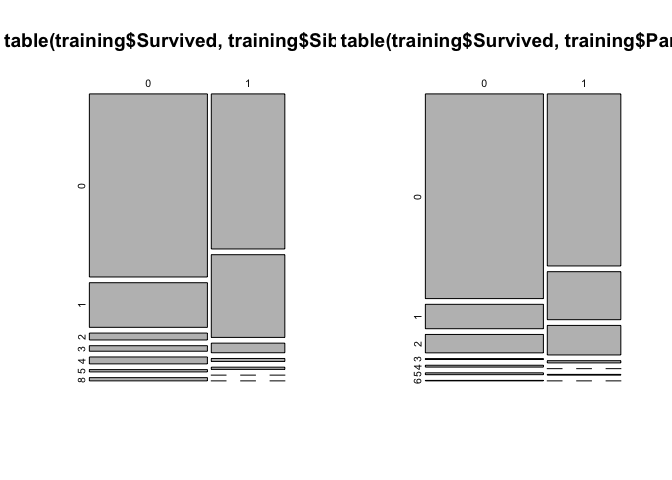<!-- -->

`SibSp` and `Parch` are fundamentally related so let's combine them into one `FamilySize` variable.


```r
# create a FamilySize variable
training$FamilySize <- training$SibSp + training$Parch
```

We can confirm we see a similar trend for our combined variable. 


```r
# plot count of survivors and victims by FamilySize
ggplot(training, aes(x = FamilySize, fill = Survived)) +
    geom_histogram(position = "dodge")
```

```
## `stat_bin()` using `bins = 30`. Pick better value with `binwidth`.
```

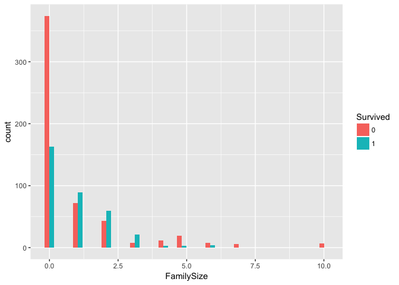<!-- -->

However I want to make this a factor variable. Beyond a family size of 3, it's unlikely that the penalty for `FamilySize` increases linearly. It seems more of a category effect.


```r
# create FamCat variable
training$FamCat <- NA
training$FamCat[training$FamilySize == 0] <- "solo"
training$FamCat[training$FamilySize == 1] <- "pair"
training$FamCat[training$FamilySize == 2] <- "trio"
training$FamCat[training$FamilySize == 3] <- "quartet"
training$FamCat[training$FamilySize >= 4] <- "large"
training$FamCat <- factor(training$FamCat, levels = c("solo","pair","trio","quartet","large"), ordered = TRUE)
```

We now get a more summarized plot.


```r
# plot count of survivors and victims by FamCat
ggplot(training, aes(x = FamCat, fill = Survived)) +
    geom_bar(position = "dodge")
```

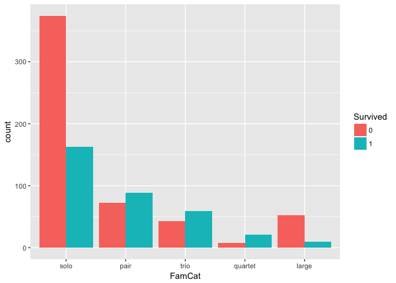<!-- -->

### Fare

We would expect those with cheaper fares would tend to survive less, and this can be seen in the boxplot below.


```r
# Surival plotted by fare
ggplot(training, aes(y = Fare, x = Survived)) + 
    geom_boxplot() +
    coord_flip()
```

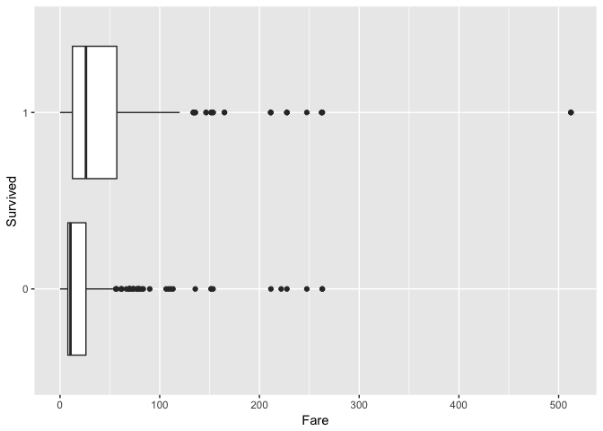<!-- -->

Taking a closer look at the number summaries (with the top outliers removed), we can see that survivors do tend to pay more. `Fare` is likely to be a useful variable in our models, but much of its information is likely already encoded in `Pclass`.


```r
# summary stats of survival by fare
summary(subset(training, 
               training$Survived == 0 & training$Fare < 300)$Fare)
```

```
##    Min. 1st Qu.  Median    Mean 3rd Qu.    Max. 
##   0.000   7.854  10.500  22.120  26.000 263.000
```

```r
summary(subset(training, 
               training$Survived == 1 & training$Fare < 300)$Fare)
```

```
##    Min. 1st Qu.  Median    Mean 3rd Qu.    Max. 
##    0.00   12.41   26.00   44.29   56.93  263.00
```

Victims tend to pay less, but there is a similar trend in the curves. But those with very cheap tickets are much more likely to be victims so let's create a new feature for cheap tickets.


```r
# fare plotted by surivors excluding 3 first class outliers
ggplot(filter(training, Fare < 400), 
       aes(x = Fare, color = Survived)) +
    geom_density() +
    geom_vline(xintercept = 13)
```

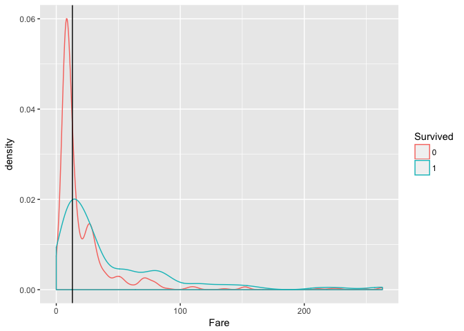<!-- -->

Plotting this intercept against `Pclass` we see this tickets belong mostly but not exclusively to third class passengers.


```r
# fare plotted by class excluding 3 first class outliers
ggplot(filter(training, Fare < 400), aes(x = Fare, color = Pclass)) +
    geom_density() +
    geom_vline(xintercept = 13)
```

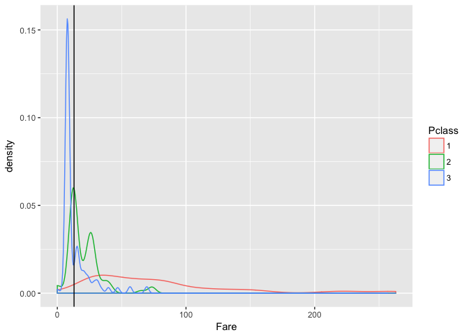<!-- -->

So any ticket purchased for 13 (presumably pounds?) or less can be given a special designation.


```r
# create CheapTix variable
training$CheapTix <- factor(ifelse(training$Fare <= 13, 1, 0))
```

We could also try binning `Fare` into a few ordered categories.


```r
# create 4 bins for Fare
training$FareBin <- cut(training$Fare, breaks = 4, 
                        ordered_result = TRUE)
```

We could also try a log transformation on `Fare`. Doing this though makes me notice that 15 passengers are reported having paid a fare of 0. I could believe these if they were third class stowaways, but many are first or second class passengers. All are male, and all but one were victims. There's perhaps errors here but for simplicity, I'll raise their fare to 0.01 so we can complete the log transformation.


```r
# 15 cheapest fares
training %>%
    arrange(Fare) %>%
    select(Survived, Pclass, Sex, Fare) %>%
    head(15)
```

```
##    Survived Pclass  Sex Fare
## 1         0      3 male    0
## 2         0      1 male    0
## 3         1      3 male    0
## 4         0      2 male    0
## 5         0      3 male    0
## 6         0      2 male    0
## 7         0      2 male    0
## 8         0      2 male    0
## 9         0      3 male    0
## 10        0      1 male    0
## 11        0      2 male    0
## 12        0      2 male    0
## 13        0      1 male    0
## 14        0      1 male    0
## 15        0      1 male    0
```

I'll raise their fare to 0.01 so we can complete the log transformation.


```r
# change fares of 0 to 0.01
training$Fare[training$Fare == 0] <- 0.01

# log transform Fare
training$FareLog <- log(training$Fare)
```

### Age

A scatterplot with some jitter also shows that `Age` is influential, but we have to take note of the missing values for this variable.


```r
# Survival plotted by age and class, faceted by sex
ggplot(training, aes(x = Age, y = Pclass, color = Survived)) + 
    geom_jitter(height = 0.1, alpha = 0.3) +
    facet_grid(Sex ~ .)
```

```
## Warning: Removed 177 rows containing missing values (geom_point).
```

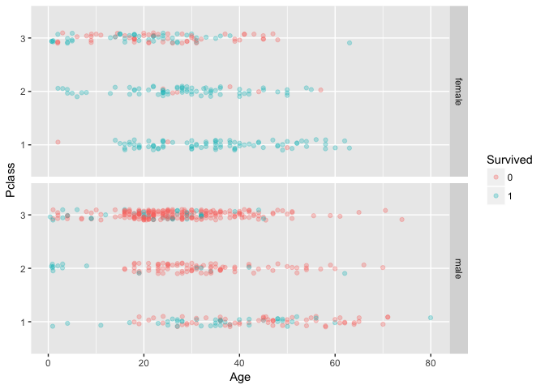<!-- -->

177 observations are missing a value for `Age`. This is almost 20% of the training data. This is a very high amount, but given how important a predictor `Age` seems to be, it would be unfortunate to exclude it.

If we compare survival rates between the full training set and the training set with missing `Age` values removed, there is little difference, and so let's assume the `Age` data is missing at random.


```r
# survival rate with missing Ages removed
training %>%
    filter(!is.na(Age)) %>%
    group_by(Survived) %>%
    dplyr::summarize(n = n(),
              survival = n()/(424+290))
```

```
## # A tibble: 2 x 3
##   Survived     n  survival
##     <fctr> <int>     <dbl>
## 1        0   424 0.5938375
## 2        1   290 0.4061625
```


```r
# survival rate across training data
training %>%
    group_by(Survived) %>%
    dplyr::summarize(n = n(),
              survival = n/nrow(training))
```

```
## # A tibble: 2 x 3
##   Survived     n  survival
##     <fctr> <int>     <dbl>
## 1        0   549 0.6161616
## 2        1   342 0.3838384
```

We can use the `mice` function in the `mice` package to predict likely values for the missing Age values without changing the overall distribution of the data. I learned about this technique [here](https://www.kaggle.com/mrisdal/exploring-survival-on-the-titanic).


```r
# impute missing Age values
set.seed(417)
tempData <- mice(training[,!names(training) %in% c("PassengerId", "Name", "Ticket", "Cabin")], method = "pmm")
```

```
## 
##  iter imp variable
##   1   1  Age
##   1   2  Age
##   1   3  Age
##   1   4  Age
##   1   5  Age
##   2   1  Age
##   2   2  Age
##   2   3  Age
##   2   4  Age
##   2   5  Age
##   3   1  Age
##   3   2  Age
##   3   3  Age
##   3   4  Age
##   3   5  Age
##   4   1  Age
##   4   2  Age
##   4   3  Age
##   4   4  Age
##   4   5  Age
##   5   1  Age
##   5   2  Age
##   5   3  Age
##   5   4  Age
##   5   5  Age
```

```r
mice_output <- complete(tempData)
```

Now confirm that the `Age` distribution has not changed by comparing histograms.


```r
# compare missing and imputed age histograms
p1 <- ggplot(training, aes(x = Age)) + geom_histogram()
p2 <- ggplot(mice_output, aes(x = Age)) + geom_histogram()
grid.arrange(p1, p2, ncol = 2)
```

```
## `stat_bin()` using `bins = 30`. Pick better value with `binwidth`.
```

```
## Warning: Removed 177 rows containing non-finite values (stat_bin).
```

```
## `stat_bin()` using `bins = 30`. Pick better value with `binwidth`.
```

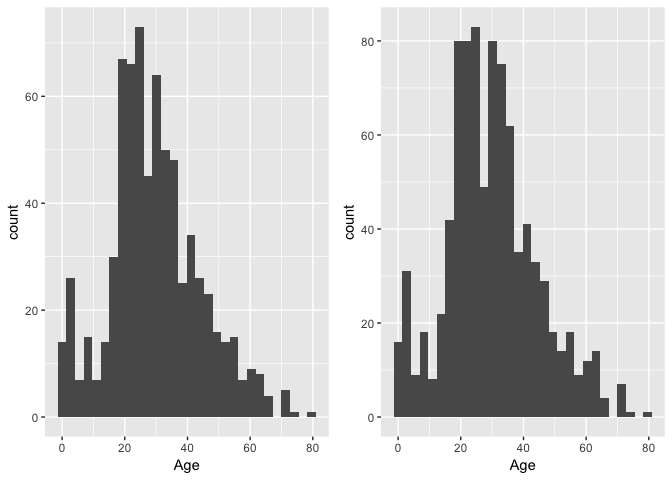<!-- -->

We can also observe the similarities of the 5-number summary.


```r
# compare pre and post age distributions
summary(training$Age)
```

```
##    Min. 1st Qu.  Median    Mean 3rd Qu.    Max.    NA's 
##    0.42   20.12   28.00   29.70   38.00   80.00     177
```

```r
summary(mice_output$Age)
```

```
##    Min. 1st Qu.  Median    Mean 3rd Qu.    Max. 
##    0.42   20.00   29.00   29.89   38.00   80.00
```

Then we can use our mice output in place of the original `Age` data. We now have no missing data. We also don't have any obvious outliers.


```r
# replace age variable with mice output
training$Age <- mice_output$Age
sum(is.na(training$Age))
```

```
## [1] 0
```

If we compare density curves of survivors and victims by age, we notice a clear difference among very young passengers.


```r
# density curves of surivors and victims by age
ggplot(training, aes(x=Age, color = Survived)) + 
    geom_density() +
    geom_vline(xintercept = 14)
```

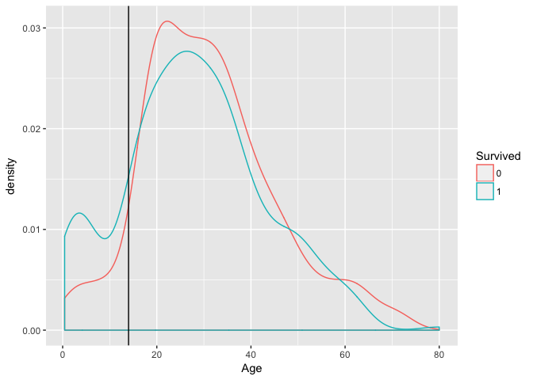<!-- -->

In light of this, let's create a `Child` variable for any `Age` less than 15.


```r
# create Child variable
training$Child <- factor(ifelse(training$Age <= 14, 1, 0))
```

More broadly, let's also bin all ages into a categorical variable.


```r
# bin Ages in a new variable
training$AgeBin <- cut(training$Age, breaks = 5, 
                       ordered_result = TRUE)
```

### No Information Variables

Finally we can drop a few variables that are not useful predictors.

* `PassengerID` is only a numeric index. 

* `Ticket` is a random numeric. 

* After having created `BerthAssgn` and `Deck`, `Cabin` is of no use.

* After having created `marriedFemale` and `Title`, we can drop `Name` too.


```r
# drop unuseful predictors
drops <- c("PassengerId","Ticket", "Cabin", "Name")
training <- training[ , !(names(training) %in% drops)]
```

From our exploration above, it would be surprising if any variables did not have enough variance to be a useful predictor. The `nearZeroVar` function however says this is the case for `FareBin`.


```r
# check for near zero variance predictors
nearZero <- nearZeroVar(training, saveMetrics = TRUE)
nearZero[nearZero$nzv == TRUE,]
```

```
##         freqRatio percentUnique zeroVar  nzv
## FareBin  29.41379     0.4489338   FALSE TRUE
```

If we look at its distribution, we see an overwhelming number of observations fall in the first bin so let's not include this feature moving forward.


```r
# distribution of FareBin
table(training$FareBin)
```

```
## 
## (-0.512,128]    (128,256]    (256,384]    (384,513] 
##          853           29            6            3
```


```r
# remove FareBin
training <- select(training, -FareBin)
```

## Model Exploration

### Feature Selection

Before splitting the data into a training a testing set, I'll first try to build a logistic regression model and get intuition about the relationship of the variables to `Survived`.

I first used `step` function to test out backwards elimination, forward selection and "both" directions. 


```r
# stepwise backward elimination
fit.back <- step(glm(Survived ~ ., data = training, family = "binomial"), direction = 'backward')

# stepwise forward elimination
null <- glm(Survived ~ 1, data = training, family = "binomial")
full <- glm(Survived ~ ., data = training, family = "binomial")
fit.forward <- step(null, scope = list(lower=null, upper=full), direction = "forward")

# stepwise both direction
fit.both <- step(glm(Survived ~ ., data = training, family = "binomial"), direction = 'both')
```

They all resulted in models with nearly the same predictors.


```r
# call of backward, forward and both step models
summary(fit.back)$call
```

```
## glm(formula = Survived ~ Pclass + Age + Title + FamCat + FareLog, 
##     family = "binomial", data = training)
```

```r
summary(fit.both)$call
```

```
## glm(formula = Survived ~ Pclass + Age + Title + FamCat + FareLog + 
##     BerthAssgn, family = "binomial", data = training)
```

```r
summary(fit.forward)$call
```

```
## glm(formula = Survived ~ Title + Pclass + FamCat + Age + FareLog + 
##     BerthAssgn, family = "binomial", data = training)
```

`Pclass`, `Age`, and `FamCat` are not surprising. Interestingly, all models preferred `Title` over `Sex`. It kept the log version of `Fare`. Forward and both models also included `BerthAssgn`. I'll save these formulas as `form1` and `form2`. With the exception of `BerthAssgn`, which didn't seem to be communicating much valuable information, our formula seems quite intuitive.


```r
form1 <- formula(Survived ~ Pclass + Age + Title + FamCat + FareLog)
form2 <- formula(Survived ~ Pclass + Age + Title + FamCat + FareLog + BerthAssgn)
```


### Data Split

Now that I've selected formulas with two sets of variables, I'll split the training data, holding out a test set. I opted for a 60/40 split after also trying 70/30 and 50/50 splits.


```r
set.seed(417)
# 60/40 split of training data
intrain <- createDataPartition(y = training$Survived, p = 0.6, 
                               list = FALSE)
train <- training[intrain,]
test <- training[-intrain,]

# confirm dimensions
dim(train); dim(test)
```

```
## [1] 536  17
```

```
## [1] 355  17
```

We can confirm that the survival rate proportions have remained the same in training and test sets.


```r
# survivor proportions in train and test sets
round(prop.table(table(train$Survived)),3)
```

```
## 
##     0     1 
## 0.616 0.384
```

```r
round(prop.table(table(test$Survived)),3)
```

```
## 
##     0     1 
## 0.617 0.383
```

### Model Building

Now with a training and test set, we can apply various ML algorithms to different model formulas and compare the accuracy on the test set of each. First we can set the same `trainControl` object for all models we want to test, and the same algorithms we want to try for each. 


```r
# set cv for all models
ctrl <- trainControl(method = "repeatedcv", number = 10, repeats = 5)

# vector of algorithms we want to try
methods <- c("glm", "glmnet", "rpart", "ranger", "svmRadial", "knn")
```

Now we can build our various models for each of the four formulas we laid out above. I should ideally have done this all in a nested loop or with my own function and a apply family command, but bear with me as I do one operation for each formula. First, let's do so for our first formula call.


```r
# initialize empty lists of model fits, predictions, and accuracies
fits <- vector("list")
pred <- vector("list")
acc <- vector("list")

# fit a series of models with different methods
for (m in methods) {
    set.seed(417)
    fits[[m]] <- train(form1, data = train, method = m, 
               trControl = ctrl, tuneLength = 5)
}

# generate predictions and accuracy for each model fits
for (mod in names(fits)) {
    pred[[mod]] <- predict(fits[[mod]], test)
    acc[[mod]] <- mean(test$Survived == pred[[mod]])
}

# save accuracies and predictions in dfs
acc.df1 <- as.data.frame(acc)
pred.df1 <- as.data.frame(pred)
acc.df1
```

```
##         glm    glmnet     rpart    ranger svmRadial       knn
## 1 0.8169014 0.8197183 0.8112676 0.8366197 0.8028169 0.7605634
```

We can repeat the same procedure using the second formula call.


```r
# initialize empty lists of model fits, predictions, and accuracies
fits <- vector("list")
pred <- vector("list")
acc <- vector("list")

# fit a series of models with different methods
for (m in methods) {
    set.seed(417)
    fits[[m]] <- train(form2, data = train, method = m, 
               trControl = ctrl, tuneLength = 5)
}

# generate predictions and accuracy for each model fits
for (mod in names(fits)) {
    pred[[mod]] <- predict(fits[[mod]], test)
    acc[[mod]] <- mean(test$Survived == pred[[mod]])
}

# save accuracies and predictions in dfs
acc.df2 <- as.data.frame(acc)
pred.df2 <- as.data.frame(pred)
acc.df2
```

```
##         glm    glmnet     rpart    ranger svmRadial       knn
## 1 0.8197183 0.8197183 0.8112676 0.8394366  0.828169 0.7352113
```

Now let's combine our results into one dataframe. Here we can see how each formula performs for each algorithm.


```r
# combine accuracy results
acc.all <- rbind(acc.df1, acc.df2)
acc.all
```

```
##         glm    glmnet     rpart    ranger svmRadial       knn
## 1 0.8169014 0.8197183 0.8112676 0.8366197 0.8028169 0.7605634
## 2 0.8197183 0.8197183 0.8112676 0.8394366 0.8281690 0.7352113
```

The two formulas are almost the same, and so it's not surprising that our model accuracies are also almost the same. A number of models perform above 80%. A simple logistic regression model performs quite well compared to more advanced algorithms. Our single highest accuracy from any formula/algorithm combination is 0.8394 from our second formula call and the ranger implementation of a random forest.

## Predictions on the Testing Set

Now that we have selected a best model amongst many, the last thing to do is to test our model on the unseen test set.

In order to do this, I'll need to create all of the variables that I feature engineered on the test set and impute any missing variables. (It's my understanding that if I had combined the training and testing datasets and done feature engineering on the full dataset, that would result in overfitting or an overly optimistic error rate. Instead we are advised not to use the test set for any exploration/feature engineering).


```r
# convert factor variables in testing set
testing$Pclass <- factor(testing$Pclass)

# extract titles 
testing$Title <- factor(str_extract(testing$Name, "\\w+(?=\\.)"))
levels(testing$Title) <- c(levels(testing$Title), "HonM")
# define reassignments
single_ladies <- c("Mlle","Lady","Ms")
hon_male <- c("Sir","Major","Col","Jonkheer","Capt","Don","Col")
mrs <- c("Mme", "Countess", "Dona")
# relabel factors
testing$Title[testing$Title %in% single_ladies] <- "Miss"
testing$Title[testing$Title %in% mrs] <- "Mrs"
testing$Title[testing$Title %in% hon_male] <- "HonM"

# drop unused levels
testing$Title <- droplevels(testing$Title)

# create a variable based on if passenger assigned a cabin
testing$BerthAssgn <- factor(ifelse(is.na(testing$Cabin), 0, 1))

# create Deck variable
testing$Deck <- substr(testing$Cabin, 1,1)
testing$Deck[is.na(testing$Deck)] <- "Missing"
testing$Deck <- factor(testing$Deck)

# create a FamilySize variable
testing$FamilySize <- testing$SibSp + testing$Parch

# create FamCat variable
testing$FamCat <- NA
testing$FamCat[testing$FamilySize == 0] <- "solo"
testing$FamCat[testing$FamilySize == 1] <- "pair"
testing$FamCat[testing$FamilySize == 2] <- "trio"
testing$FamCat[testing$FamilySize == 3] <- "quartet"
testing$FamCat[testing$FamilySize >= 4] <- "large"
testing$FamCat <- factor(testing$FamCat, levels = c("solo","pair","trio","quartet","large"), ordered = TRUE)

# impute 1 missing Fare value with median
testing$Fare[is.na(testing$Fare)] <- mean(testing$Fare, na.rm = TRUE)

# create CheapTix variable
testing$CheapTix <- factor(ifelse(testing$Fare <= 13, 1, 0))

# change fares of 0 to 0.01
testing$Fare[testing$Fare == 0] <- 0.01

# log transform Fare
testing$FareLog <- log(testing$Fare)

# impute missing Age values
set.seed(417)
tempData <- mice(testing[,!names(testing) %in% c("PassengerId", "Name", "Ticket", "Cabin")], method = "pmm")
```

```
## 
##  iter imp variable
##   1   1  Age
##   1   2  Age
##   1   3  Age
##   1   4  Age
##   1   5  Age
##   2   1  Age
##   2   2  Age
##   2   3  Age
##   2   4  Age
##   2   5  Age
##   3   1  Age
##   3   2  Age
##   3   3  Age
##   3   4  Age
##   3   5  Age
##   4   1  Age
##   4   2  Age
##   4   3  Age
##   4   4  Age
##   4   5  Age
##   5   1  Age
##   5   2  Age
##   5   3  Age
##   5   4  Age
##   5   5  Age
```

```r
mice_output <- complete(tempData)

# replace age variable with mice output
testing$Age <- mice_output$Age

# create Child variable
testing$Child <- factor(ifelse(testing$Age <= 14, 1, 0))

# bin Ages in a new variable
testing$AgeBin <- cut(testing$Age, breaks = 5, 
                       ordered_result = TRUE)
# drop unuseful predictors
drops <- c("Ticket", "Cabin", "Name")
testing <- testing[ , !(names(testing) %in% drops)]
```

For clarity let's recall our formula that produced the best results:


```r
form2
```

```
## Survived ~ Pclass + Age + Title + FamCat + FareLog + BerthAssgn
```

And save its use in our best performing model, which we can show once more has an accuracy very close to 84%.


```r
set.seed(417)
fit.best <- train(form2, data = train, method = "ranger", 
               trControl = ctrl, tuneLength = 5)

# Make predictions on the test dataset
pred.best <- predict(fit.best, test)

# Examine the confusion matrix
table(test$Survived, pred.best)
```

```
##    pred.best
##       0   1
##   0 200  19
##   1  38  98
```

```r
# Compute the accuracy on the test dataset
mean(test$Survived == pred.best)
```

```
## [1] 0.8394366
```

Now we use the `predict` function to apply our model to the `testing` dataset and save those predictions into the dataset. We can confirm that the length of our `submission` is the same as the length of `testing`. Then we only keep the two columns needed for Kaggle submission and write a csv.


```r
set.seed(417)
# generate predictions on testing dataset
testing$Survived <- predict(fit.best, testing)

# keep requested columns
submission <- testing[,c("PassengerId", "Survived")]

# Write the solution to file
write.csv(submission, file = 'submission.csv', row.names = FALSE)
```

Unfortunately when I submit, my public leaderboard score is only 0.78468. This is far lower than my local CV score. I've read that local CV scores are seen as more reliable than the public leaderboard (which is based on 50% of the testing data). Nevertheless, this seems like too great of a difference. Something perhaps went wrong! Any suggestions much appreciated.
